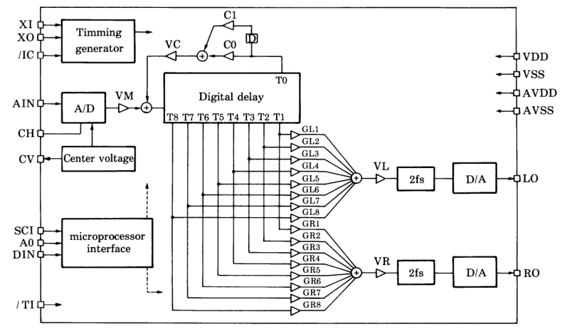
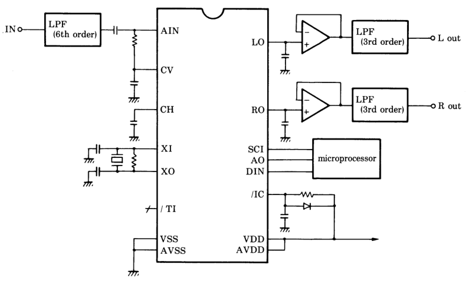
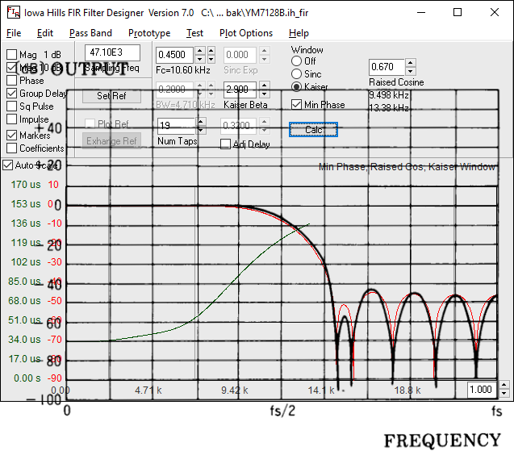

# YM7128B

This library aims to emulate the
[*Yamaha YM7128B* Surround Processor](doc/YM7128-ETC.pdf).



The original goal is to contribute to the emulation of the *AdLib Gold* sound
card, which used such integrated circuit to add surround effects to the audio
output, as heard in the beautiful soundtrack of the *Dune* videogame, made
specifically for that rare sound card.

As I do not know how the actual circuits are made, I cannot emulate the chip
perfectly. Instead, my goal is to simulate the overall sound, based on the
short information available, and with some assumptions based on other Yamaha
chips of the same age, as far as I know.

If anybody can analyze a decapped chip, that would of course be the best
information, as already done for many vintage sound chips.

I am willing to get some real chips, as long as they are available for
purchase, at least for black-box comparisons with dedicated test vectors.

_______________________________________________________________________________

## Engines

The library provides chip emulation with three engines:

- **Fixed**: it should emulate an actual chip, using fixed point arithmetics.
    It features all the actual chip constraints, like sample rates, the
    presence of an output oversampler, and saturated arithmetics. Algorithms
    are rather slow to compute, and resampling is typically heavy.

- **Float**: like *Fixed*, using floating point arithmetics instead.
    It increases the sound quality, while keeping the architecture similar to
    that of an actual chip. Algorithms are fast to compute, but resampling
    still has a significant impact on performance.

- **Ideal**: it represents an ideal implementation of the algorithms.
    Arithmetics are in floating point, there are no saturations, and no sample
    rate conversions, not even at the output stage. Algorithms are fast,
    despite the loss in accuracy with respect to an actual chip.

- **Short**: somewhat an hybrid of *Fixed* and *Ideal*, in that it uses
    full-range 16-bit fixed point arithmetics with saturations, but without
    sample rate conversions. Algorithms are fast, despite the loss in accuracy
    with respect to an actual chip.

In the following table, an overview of the features of each engine:

| Feature               | *Fixed*                     | *Float*                     | *Ideal*                 | *Short*                 |
|-----------------------|-----------------------------|-----------------------------|-------------------------|-------------------------|
| Input filter          | suggested: 6th order 15 kHz | suggested: 6th order 15 kHz | not required            | not required            |
| Input signal          | Q1.13                       | double, normalized          | double                  | Q1.15                   |
| Input rate            | 23550 Hz                    | 23550 Hz                    | suggested: above 40 kHz | suggested: above 40 kHz |
| Saturated arithmetics | yes                         | yes, normalized             | no                      | yes                     |
| Signal operand        | Q1.15                       | double                      | double                  | Q1.15                   |
| Gain operand          | Q1.11                       | double                      | double                  | Q1.15                   |
| Feedback operand      | Q1.5                        | double                      | double                  | Q1.5                    |
| Oversampler operand   | Q1.11                       | double                      | no oversampling         | no oversampling         |
| Output rate           | 47100 Hz                    | 47100 Hz                    | same as input           | same as input           |
| Output signal         | Q1.13                       | double, normalized          | double                  | Q1.15                   |
| Output filter         | suggested: 3rd order 15 kHz | suggested: 3rd order 15 kHz | not required            | not required            |
| Status memory         | allocated by the user       | allocated by the user       | allocated by the user   | allocated by the user   |
| Delay memory          | part of the status          | part of the status          | dynamic heap allocation | dynamic heap allocation |
| Performance           | very slow                   | slow                        | fast                    | fast                    |
| Accuracy              | best?                       | good                        | poor                    | poor                    |

_______________________________________________________________________________

## Usage

To use this library, just include `YM7128B_emu.c` and `YM7128B_emu.h`
into your project.

All the engines implement the same conceptual flow:

1. Status memory allocation.
2. Call **Ctor()** method to invalidate internal data.
3. Call **Reset()** method to clear emulated registers.
4. Call **SetSampleRate()** to allocate internal delay memory
   (only for *Ideal* engine).
5. Call **Start()** to start the algorithms.
6. Processing loop:
    1. Filter input samples.
    2. Resample input samples.
    3. For each sample:
       1. Call **Process()** method, with appropriate data types.
    4. Resample output samples.
    5. Filter output samples.
7. Call **Stop()** method to stop the algorithms.
8. Call **Dtor()** method to deallocate and invalidate internal data.
9. Status memory deallocation.

Register access timings are not emulated.

_______________________________________________________________________________

## Sample rate conversion

The biggest concern is about the weird sampling rates of the original chip:
23.6 kHz for input, and 47.1 kHz for output.

Since modern common audio sample rates are based either on audio CD (44.1 kHz),
or legacy professional audio (48 kHz), the sampling rate of most late '80s
Yamaha products need sample rate conversion both at input and output to be
emulated by software.

Quality realtime conversions of such unusual sample rates intrinsically
require more CPU time than the chip emulation itself, so expect them to be the
actual bootleneck of the emulation.

Also, sample rate conversions add delays to their outputs, which are not
welcome to realtime processing.


### Libraries

This library does not provide sample rate conversion itself, because proper
conversion (without audible distortion) is not trivial at all. Instead, there
are many libraries available, each with its quality rating, performance,
and licensing.
You can find a comprehensive comparison
[at Infinite Wave's website](https://src.infinitewave.ca/).

Personally, I have tried the following open source libraries with success:

- [secret rabbit code 0.1.9](http://www.mega-nerd.com/SRC/)
([download](http://www.mega-nerd.com/SRC/download.html) -
[github](https://github.com/erikd/libsamplerate/)):
A nice mature C library, easy to use, licensed as *2-clause BSD*.
Not the most lightweight for realtime, nor in performance, nor in code size.

- [r8brain free 4.6](https://github.com/avaneev/r8brain-free-src/)
([github](https://github.com/avaneev/r8brain-free-src/)):
Free version of a commercial C++ library, licensed as *2-clause BSD*.
Suitable for realtime, and with small footprint.

- [zita-resampler 1.6.2](https://kokkinizita.linuxaudio.org/linuxaudio/zita-resampler/resampler.html)
([download](https://kokkinizita.linuxaudio.org/linuxaudio/downloads/index.html) -
[github](https://github.com/jpcima/zita-resampler/)):
A nice modern C++ library, licensed as *GPL3*.
Suitable for realtime, and with small footprint.


### Analog filtering

The datasheet suggests some input and output analog filtering, to reduce
aliasing effects, more specifically a 6th order low-pass input filter, and a
3rd order low-pass output filter.
Such filters should be considered into the system emulation, because an actual
physical system needs them. I do not know how the *AdLib Gold* filtered them.

I do not have specifications about them, but they should be *Butterworth*
filters (common analog audio filters), and I guess the cut-off frequency is
around 15 kHz (common for FM radio, *Sound Blaster*, etc.).



Again, analog filters are not provided by the library, to give the user freedom
about their implementation (e.g. [Robert Bristow-Johnson's Audio EQ Cookbook](https://www.w3.org/2011/audio/audio-eq-cookbook.html)
\- [text](https://raw.githubusercontent.com/shepazu/Audio-EQ-Cookbook/master/Audio-EQ-Cookbook.txt)).

_______________________________________________________________________________

## Implementation details

Here you can find some descriptions and discussions about implementation
details.


### Language

I chose *C89* with a bit of *C99*. I was going to use *C++20* for my own
pleasure, but instead I find good old and mature C to be the best for such a
tiny library. C is also easier to integrate with other languages, and the
mighty features of a colossal language like C++ are more of a burden than for
actual use in such case.


### Cross-platform support

The code itself should be cross-platform and clean enough not to give
compilation errors or ambiguity.

Currently the library is developed and tested under *Windows* with *MSVC++ 14*.
Of course, I will at least provide support for *gcc* and *clang* under *Linux*.
I do not have access to *macOS*, but I guess the *Linux* support should fit.


### Code style

I chose the path of verbosity for variable declaration, to help debugging fixed
point math and buffering. Indeed, when compiled for performance, all those
variable declarations get optimized away easily.

I did not write the code for explicit vectoring, preferring a *KISS* approach
at this stage of development. Actually I am not satisfied about how the
*MSVC++* compiler is generating machine code, and I guess that optimizing the
code for vectoring should improve the performance by some margin, especially
the parts for parallel 8-tap delay and output oversampling.


### Sample format

The datasheet claims 14-bit *floating point* sampling for both input and
output. There is no information about such esoteric format itself, but there
are datasheets of Yamaha products of the same age that do.
I know only the *YM3014B* for reference, which claims 16-bit (linear) dynamic
range, against floating point samples with 3-bit exponent and 10-bit mantissa.

Anyway, the datasheet clearly states that the analog input is converted to
14-bit digital signal, so we can assume that samples are 14-bit wide.
There is no mention of sign bits, as the A/D converter is monopolar (Vdd/2
center voltage bias), but I think the 14-bit samples are unbiased (signed) by
the A/D converter itself, to agree with all the two-complement computations.
The reverse operation is done by the D/A converter.

I am actually concerned about the bit size of each sample. Its sounds like the
14-bit multiplication results sound pretty awful for small signals, the way I
am emulating the system right now.
Tests with 16-bit sample emulation sound less worse, so I am wondering whether
signals are actually processed as 14-bit or more.


### Multiplication

Being a DSP, one of the most common operations is multiplication. Since this
operation requires many logic gates, I guess there is only one multiplier in
the chip, reused within the hundreds of clock ticks per sample.

The only information about multiplication comes from the description of
feedback coefficients in the datasheet, which states that the 6 data bits of
the registers are mapped onto the 6 most significant bits of the 12-bit
two-complement operand, sign bit included.
I think that the remaining 6 bits are not wasted only for such operation, but
instead the very same multiplier is shared also for gain (decibel)
multiplications.

So, we have a multiplier that has a signal operand 14-bit wide, and a gain
operand 12-bit wide. The result should be a signal itself, 14-bit wide.

The multiplication is implemented as a classic 16-bit x 16-bit signed
fixed-point multiplication (aka *Q15*), keeping only the 14 most significant
bits.

Actually, since 14-bit operand sounds awful, unlike the few recordings
found on the internet, I am using 16-bit operands right now.

### Feedback coefficients

The datasheet is very clear about feedback coefficients: they are 6-bit values
mapped directly from the register data to the 12-bit two-complement operand of
the multiplier, padded with zeros at the least significant operand bits.


Feedback coefficients seem to be a special case of gains, being mapped directly
as operands, while gains are remapped with a lookup table.

### Gain coefficients

The datasheet mentions the gain coefficients in terms of decibels, tabulated
into a table with 32 entries.
Entries go from unity gain (0 dB) at the highest index, down to -60 dB at the
second-lowest index, in steps of 2 dB. The lowest index (zero) is reserved for
silence. This gives a good granularity to volume levels (2 dB is a common
step size in incremental volume control).

I think that such entries are saved into a single table with non-negative
11-bit linear coefficients, from silence (all bits 0) to maximum volume
(all bits 1).

I guess the negative coefficients are actually loaded as the one-complement
(bit flip) instead of the two-complement, as often seen in Yamaha's
synthesizers of the same age, to save silicon area despite a tiny gain error.


### Digital delay line

The digital delay line allows up to 100 ms of delay at the nominal input rate.
This leads to a buffer of at least 2355 samples.
Such buffer should be a shifting FIFO with 32 pre-determined tap positions.

The delay line emulation is actually implemented as a random-access ring
buffer, as shifting the whole buffer at each input sample is a waste of time.


### Oversampler

The chip includes a 2x oversampling interpolator at the output stage, to help
reduce the analog circuitry to reconstruct the output from the 47.1 kHz
oversampled D/A data.

I guess the interpolator is a FIR filter that reuses the same DSP circuitry for
gain and coefficient fixed-point multiplication, to save silicon area.

The datasheet shows only the *magnitude versus freuquency response*.
So, based on such information, I tried to match the reponse with
[Iowa Hills FIR Filter Designer 7.0](http://www.iowahills.com/8DownloadPage.html)
by trial and error. The parameters I found do not look exacly as per the
diagram of the datasheet, but the actual response should not differ too much:



I also think that the kernel is not *minimum-phase*, to save further silicon
area, thanks to the mirrored coefficient values.
I am no expert, but it looks like minimum-phase is also not welcome to audio,
because of phase-incoherence among frequencies, despite having shorter delays.
I left the possibility to choose the minimum-phase feature by configuration.

_______________________________________________________________________________

## YM7128B_pipe example

This repository provides a fully-featured example. It is a stream processor, in
that it processes sample data coming from *standard input*, elaborates it, and
generates outputs on the *standard output*.

Please refer to its own help page, by calling the canonical
`YM7128B_pipe --help`, or reading it embedded in
[its source code](example/YM7128B_pipe.c).

### Usage example with Lubuntu 20.04

1. Ensure the following packages are installed:

```bash
sudo apt install alsa-utils build-essential
```

2. Enter [example](example) folder and run [make_gcc.sh](example/make_gcc.sh):

```bash
cd example
bash make_gcc.sh
```

3. You should find the generated executable file as `YM7128B_pipe`.

4. Play some audio directly with `aplay` (the `\` is for command line
   continuation), using the `dune/warsong` preset:

```bash
./YM7128B_pipe -r 23550 -f S16_LE --preset dune/warsong < sample_mono_23550Hz_S16LE.raw \
| aplay -c 2 -r 47100 -f S16_LE
```
